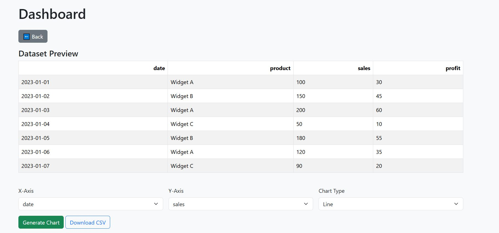

# Data Analytics Dashboard

A lightweight web application built with Flask that allows users to upload CSV files, visualize data through interactive charts, filter datasets, and download processed data.

## Features

- 📊 **CSV Upload**: Easily upload your datasets in CSV format
- 👀 **Data Preview**: View the first 10 rows of your dataset
- 📈 **Interactive Visualizations**: Create scatter plots with Plotly
- 🔍 **Data Filtering**: Filter data by selecting specific columns
- 💾 **Export Data**: Download filtered datasets as CSV files
- 🎨 **Clean UI**: Bootstrap-powered responsive interface

## Quick Start

### Prerequisites

- Python 3.7 or higher
- pip (Python package installer)

### Installation

1. Clone or download this repository
2. Navigate to the project directory
3. Create a virtual environment:

python -m venv venv

4. Activate the virtual environment:

- On macOS/Linux:
  
  source venv/bin/activate
  
- On Windows:
  
  venv\Scripts\activate
  

5. Install the required dependencies:

pip install -r requirements.txt

### Running the Application

1. Set up the environment variables:

- On macOS/Linux:
  
  export FLASK_APP=app.py
  export FLASK_ENV=development
 
- On Windows (Command Prompt):
  
  set FLASK_APP=app.py
  set FLASK_ENV=development

- On Windows (PowerShell):
 
  $env:FLASK_APP="app.py"
  $env:FLASK_ENV="development"

2. Start the Flask development server:

flask run

3. Open your web browser and navigate to the local address shown in your terminal (typically http://127.0.0.1:0000)

## Usage

1. **Upload a CSV File**: Click on "Choose File" and select your CSV dataset
2. **Preview Data**: Review the first 10 rows of your dataset
3. **Create Visualizations**: 
   - Select X and Y axes from dropdown menus
   - Click "Generate Plot" to create an interactive chart
4. **Filter Data**: 
   - Select columns to include in your filtered dataset
   - Click "Apply Filter" to process the data
5. **Download Results**: Click "Download Filtered CSV" to save your filtered data

## 📸 Screenshot

## Project Structure

data_dashboard/
├── app.py                 # Main Flask application
├── requirements.txt       # Python dependencies
├── README.md             # Project documentation
├── templates/
│   ├── index.html        # Main upload page
│   └── dashboard.html    # Data visualization and filtering page
├── static/
│   └── styles.css        # Custom styles (if any)
├── uploads/              # Directory for uploaded files (auto-created)
└── data/                 # Directory for processed data (auto-created)

## Technologies Used

- **Backend**: Flask (Python web framework)
- **Data Processing**: Pandas (data manipulation and analysis)
- **Visualization**: Plotly (interactive charts)
- **Frontend**: HTML, Bootstrap (responsive UI)

## Sample Datasets

To test the application, you can use any CSV file. Some good options include:
- Simple data with numeric columns (e.g., sales data, survey results)
- Time series data (e.g., stock prices, weather data)
- Demographic data (e.g., age vs. income)

## Troubleshooting

1. **Port already in use**: If the default port is occupied, use `flask run --port=5001`
2. **Module not found error**: Ensure you've activated the virtual environment and installed requirements
3. **Upload fails**: Check that the uploads directory exists and has write permissions

## Future Enhancements

- User authentication and session management
- Support for more chart types (bar, line, histogram)
- Advanced filtering options
- Database integration (PostgreSQL)
- Server-side pagination for large datasets
- Improved error handling and data validation

## Contributing

Contributions are welcome! Please feel free to submit a Pull Request.

## License

This project is open source and available under the [MIT License](LICENSE).

## Support

If you encounter any issues or have questions, please open an issue in the GitHub repository.